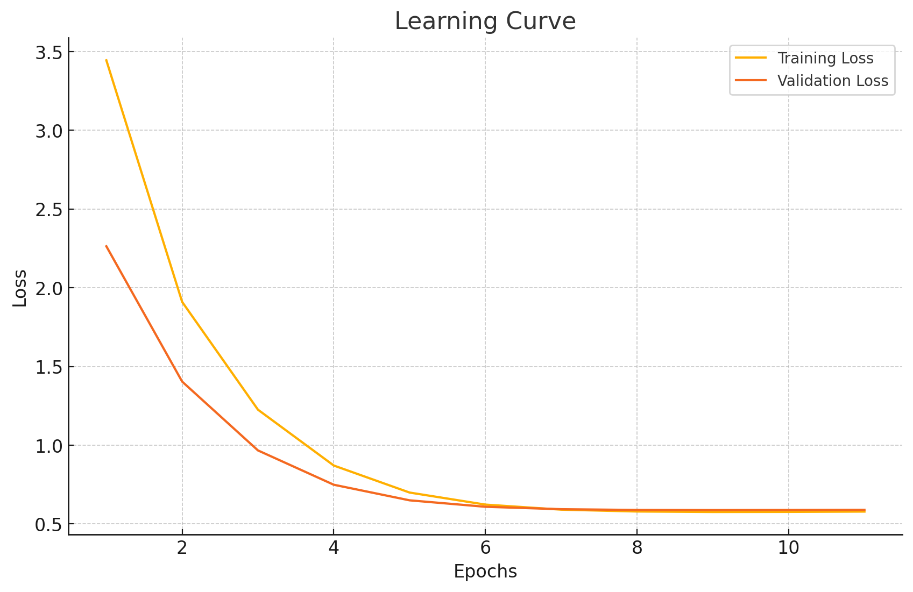

# Steam Game Recommender
This project is a framework for recommendation system that suggests Steam games based on user reviews using a collaborative filtering approach.

## Overview
This project showcases a collaborative filtering-based recommendation system designed to suggest Steam games to users based on their review preferences. The methodology incorporates an advanced model, SVD++, and operates on a dataset of Steam reviews, which is stored in Google BigQuery, a scalable cloud data warehouse. This setup allows efficient handling of the large dataset (approximately 9GB) focusing on user interactions with various games.

### Collaborative Filtering (CF)
Collaborative Filtering is a technique used in recommendation systems where the system predicts a user’s preferences based on the preferences of other users with similar tastes. Our implementation leverages user-item interaction data, particularly reviews indicating whether a user liked (voted up) or disliked (voted down) a game.

### SVD++
SVD++ is an enhancement over the traditional singular value decomposition (SVD) method for collaborative filtering. It extends SVD by taking into account implicit feedback (e.g., all the items reviewed by a user, regardless of rating). It factors in both explicit interactions (ratings) and implicit interactions (review history), making the model better at handling sparse datasets and providing more personalized recommendations.

## Data
The dataset includes reviews from multiple users across numerous Steam games, classified into positive and negative reviews. 

The complete dataset used for this project is available on Kaggle: [Steam Reviews Dataset](https://www.kaggle.com/datasets/kieranpoc/steam-reviews/data).

### Preprocessing
1. Load data: Get review data from BigQuery.

2. Clean data:
   - Keep only important columns (users, games, ratings).
   - Remove duplicate reviews.

3. Focus on popular games:
   - Keep only the top 25,000 most reviewed games.

4. Balance dataset:
   - Make sure there's an equal number of positive and negative reviews.

5. Calculate stats:
   - Count users, games, and reviews.
   - Check how balanced the ratings are.

6. Analyze user behavior:
   - Find out how many games each user rates on average.

7. Check data sparsity:
   - See how many possible ratings are actually given.

These steps make the data clean, balanced, and ready for building a recommendation system.

### After Preprocessing

| Description                | N samples   |
|----------------------------|-------------|
| Total number of reviews    | 6,054,698   |
| Number of unique users     | 1,510,565   |
| Number of unique games     | 15,000      |
| Average number of ratings per user | 4 (high sparcity)   |
| Positive reviews           | 3,027,349   |
| Negative reviews           | 3,027,349   |

The dataset is hosted on Google BigQuery, which facilitates the management of large amounts of data. BigQuery's capabilities enable rapid querying and retrieval, making it ideal for the analytics required by this recommendation system.   

## Implementation
The model's implementation involved the following steps:
1. Preprocessing the input data to balance the number of positive and negative reviews for a more unbiased training process.
2. Splitting data into training and validation sets.
3. Training the SVD++ model using the training dataset with an early stopping mechanism to prevent overfitting.
4. Evaluating the model on the validation set.

## Evaluation Metrics
| Metric | Value    |
|--------|----------|
| MAP@10 | 0.9988   |
| NDCG@10| 0.9721   |
| HR@10  | 0.9998   |

### MAP@10 (Mean Average Precision at 10)
**MAP@10** measures the average precision at each possible relevant item retrieval within the top 10 recommendations, emphasizing the order and relevance of item retrieval.

### NDCG@10 (Normalized Discounted Cumulative Gain at 10)
**NDCG@10** assesses the ranking quality of the recommendations by giving higher importance to hits at higher ranks within the top 10 recommendations.

### HR@10 (Hit Rate at 10)
**HR@10** indicates whether at least one relevant item is present in the top 10 recommendations, focusing simply on the presence of relevant items.

## Recommendations

Example recommendations for a new steam user:   

Number of user ratings: 23    
Positive ratings: 9    
Negative ratings: 14    

### Top 15 Recommended Games for the User

| Game                                              | Prediction Score | Popularity (Reviews) |
|---------------------------------------------------|------------------|----------------------|
| Dead by Daylight                                  | 0.9155           | 4458                 |
| Depth                                             | 0.9046           | 960                  |
| The Riftbreaker                                   | 0.9038           | 396                  |
| Rise of the Tomb Raider                           | 0.9032           | 2992                 |
| Minion Masters                                    | 0.8892           | 1056                 |
| VA-11 Hall-A: Cyberpunk Bartender Action          | 0.8853           | 880                  |
| DOOM 64                                           | 0.8781           | 472                  |
| Dead Space (2008)                                 | 0.8750           | 1293                 |
| FINAL FANTASY VII                                 | 0.8723           | 576                  |
| Counter-Strike 2                                  | 0.8722           | 10829                |
| BIOMUTANT                                         | 0.8704           | 518                  |
| Tom Clancy's Rainbow Six Siege                    | 0.8640           | 5841                 |
| METAL GEAR RISING: REVENGEANCE                    | 0.8623           | 1698                 |
| Ricochet                                          | 0.8619           | 310                  |
| Everhood                                          | 0.8608           | 362                  |

### User prefrences table used for recommendations:
| Game                       | Liked    |
|----------------------------|----------|
| Grand Theft Auto V         | 1        |
| Cyberpunk 2077             | 1        |
| Tomb Raider                | 1        |
| Euro Truck Simulator 2     | 0        |
| Vampire Survivors          | 0        |
| Baldur's Gate 3            | 0        |
| Risk of Rain 2             | 0        |
| Team Fortress 2            | 0        |
| Fallout 4                  | 1        |
| ELDEN RING                 | 0        |
| The Forest                 | 0        |
| Destiny 2                  | 0        |
| Unturned                   | 0        |
| Portal                     | 1        |
| Rocket League              | 0        |
| Apex Legends               | 0        |
| Max Payne 3                | 1        |
| Counter-Strike: Global Offensive | 0        |
| BioShock Remastered        | 1        |
| Battlefield V              | 1        |
| Arma 3                     | 1        |
| Borderlands 3              | 0        |
| Dying Light                | 0        |

These recommendations are generated based on the user's previous interactions with various games available on Steam, aiming to enrich their gaming experience by suggesting titles likely to be of interest.

## Conclusion
The developed recommendation system demonstrates the potential to provide highly accurate game suggestions on the Steam platform using collaborative filtering with the SVD++ model. It efficiently handles a large dataset by focusing on balancing and optimizing interactions, making the system robust and reliable for real-world applications.
